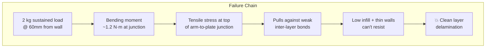

# Mi Smart Projector 2 Wall Bracket — Structural Redesign (v3)

Redesign the wall-mounted projector bracket to eliminate the stress fracture at the wall plate, and provide optimized Cura slicing settings for the Ender 3 Pro.

## Context & Measured Dimensions

| Parameter | Value |
|---|---|
| Projector | Xiaomi Mi Smart Projector 2 (115 × 150 × 150 mm) |
| Total load | ~2 kg → **~19.6 N** |
| **Wall plate body** | **40 mm wide × 70 mm tall × 10 mm thick** |
| **Horizontal mounting flange** | **70 mm wide × 10 mm tall** |
| **Arm depth (from wall)** | **60 mm** |
| **Fork prong thickness** | **10 mm** each |
| Bending moment at wall | **~1.2 N·m** (19.6 N × 0.06 m) |
| Material used | PLA (white) |
| Printer | Ender 3 Pro (Marlin) |

## Fracture Analysis

The piece broke **at the horizontal junction between the arm block and the wall plate**, right where the bending moment peaks.

### What the fracture surface tells us

From the photos of the broken print:

1. **Inter-layer delamination** — The break is a clean, flat horizontal surface following a layer boundary. The layers peeled apart under tensile stress rather than the material fracturing through its bulk. This is the weakest failure mode for FDM prints.

2. **Low infill density (~15-20%)** — The exposed honeycomb/grid pattern at the fracture is sparse. For a structural cantilever under sustained load, this is far too low.

3. **Thin perimeter walls** — The shell around the infill appears to be only 2-3 walls (~0.8-1.2 mm). The walls carry most of the bending load in a cantilever, so they need to be thicker.

4. **Layer orientation aligned with stress** — When mounted on the wall, the cantilever bending creates tension at the top of the junction. If layers are horizontal (as they appear), this tension pulls directly against inter-layer adhesion — the weakest bond in any FDM print.



---

## Proposed Improvements

### Part 1: Geometry Changes (build123d rebuild)

#### 1. Unified Wall Plate — Remove the T-Flange ⭐ (Design Simplification)

> [!IMPORTANT]
> User-proposed improvement: eliminate the T-shaped base entirely and make the wall plate one **continuous, uniform-width piece** (70 mm wide from bottom to top).

This change alone fixes the #1 problem:
- **Eliminates the T-junction** — the exact point where the piece broke
- **Continuous perimeter walls** — the slicer lays uninterrupted wall lines from bottom to top with no abrupt 90° turn
- **Simpler to print** — fewer overhangs, cleaner layer stacking
- **More material at the critical section** — wider cross-section where the arm meets the plate

```
ORIGINAL (T-shape, broke → ✗):      NEW (unified → ✓):

  ┌──40mm──┐                         ┌────70mm────┐
  │ ◯ pin  │                         │   ◯  ◯     │ fork prongs
  │  body  │                         │            │
  │        │                         │  arm block │ 60mm deep
  │   ✗ BROKE HERE                   │            │
══╪════════╪══ T-flange              │ ◯        ◯│ 4× M4 holes
  └─70mm───┘                         │ wall plate │
                                     │ ◯        ◯│
                                     └────────────┘
```

**Updated wall plate dimensions:**
| Part | Old | New |
|---|---|---|
| Wall plate width | 40mm body + 70mm flange | **70 mm uniform** |
| Wall plate height | 70mm + 10mm flange | **90-100 mm** (taller to fit 4 holes below arm) |
| Wall plate thickness | 10 mm | **10 mm** (same) |

---

#### 2. Add Triangular Gussets (Most Critical Structural Addition)
> [!IMPORTANT]
> Gussets convert bending stress into shear and compression, which FDM parts handle far better than tension/delamination.

- Add **two triangular gussets**, one on each side of the arm
- Each gusset: **4-5 mm thick**
- Extend **~40 mm** down the wall plate and **~30 mm** along the arm depth
- This creates a triangulated load path and dramatically increases the effective cross-section at the junction

```
Side view with gusset:

         ┌──────┐  arm (60mm deep)
         │      │
  ═══════╪══╲   ║══  wall plate (10mm thick)
         │    ╲ ║
         │  gusset
         │      ║
         └──────╝
```

#### 3. Fillet All Sharp Junctions
- Add **8-10 mm radius fillets** at every 90° transition, especially:
  - Arm-to-wall-plate junction (where it broke!)
  - Arm-to-fork-prong transitions
  - Gusset edges
- Fillets reduce peak stress by **40-60%** compared to sharp corners

#### 4. Add Stiffening Ribs on Wall Plate
- Add **2-3 horizontal ribs** (2 mm thick, 3-4 mm tall) on the wall-facing side of the plate
- These prevent the plate from flexing/bowing under the prying force from the cantilever

---

### Part 2: Cura Slicing Settings (Ender 3 Pro)

> [!WARNING]
> **Material recommendation:** Switch to **PETG** if possible. PETG has much better creep resistance, higher inter-layer adhesion, and is less brittle than PLA. The Ender 3 Pro handles PETG well at 230-240°C hotend / 70-80°C bed.

#### Recommended Cura Profile

| Setting | Value | Why |
|---|---|---|
| **Layer Height** | 0.2 mm | Balance of speed and layer bond |
| **Line Width** | 0.44 mm (110% nozzle) | Wider lines = better layer squish & adhesion |
| **Wall Count** | **5-6 walls** (≥2.0 mm shell) | Walls carry the bending load, not infill. This is critical. |
| **Top/Bottom Layers** | 6-8 | Solid caps resist flex |
| **Infill Density** | **40-50%** | Structural part needs high density |
| **Infill Pattern** | **Gyroid** | Best isotropic strength; resists forces from all directions |
| **Print Temperature** | PLA: 215°C / PETG: 235°C | Hotter = better layer fusion |
| **Bed Temperature** | PLA: 60°C / PETG: 75°C | Standard |
| **Print Speed** | **40-45 mm/s** | Slower = more time for layer bonding |
| **Cooling Fan** | PLA: 80-100% / PETG: 40-50% | Less cooling = better inter-layer adhesion |
| **Retraction** | 5-6 mm at 40 mm/s | Standard Ender 3 Bowden |
| **Support** | Tree supports where needed | For gusset overhangs |

#### Print Orientation

> [!IMPORTANT]
> **Print the wall plate flat on the bed**, with the arm growing upward. This makes the layer lines perpendicular to the arm axis, so the bending stress acts in **shear across layers** rather than **tension pulling layers apart**.

```
Print orientation on bed:

  ═══════════ Build plate ═══════════
  ┌────────────────────────────────┐
  │    WALL PLATE (flat on bed)    │  ← Layer 1-50
  │    with mounting holes         │
  ├────────────────────────────────┤
  │    GUSSETS + ARM BLOCK         │  ← Layer 50-150
  │    (growing upward)            │
  ├──────────┐          ┌──────────┤
  │  FORK    │          │  FORK    │  ← Top layers
  │  PRONG   │          │  PRONG   │
  └──────────┘          └──────────┘
```

If the gussets create overhang angles greater than 45°, use tree supports set to:
- Support angle: 50°
- Support interface: enabled (2-3 layers)
- Support Z distance: 0.2 mm

---

## Open Questions

> [!IMPORTANT]
> **Material choice:** Are you willing to switch to PETG for this reprint? PLA with the structural improvements will be much stronger, but PETG is the right long-term material for a permanent wall mount.

> [!NOTE]
> **Scope:** Do the hinge mechanism and projector cradle also need redesign, or only the wall bracket?

> [!NOTE]
> **Wall type:** What kind of wall are you mounting to? (Drywall + anchors, concrete, wood stud?) This affects mounting hole sizing.

> [!NOTE]
> **Bolt size:** What size bolt did you use for the hinge pin? (Looks like M6 or M8 from photos.) This determines the bore hole diameter.

---

## Build123d Rebuild Roadmap

Step-by-step implementation progress:

| Step | What you'll build | Status | Key build123d concepts used |
|---|---|---|---|
| 1 | Project setup & imports | ✅ Complete | `BuildPart`, coordinate system, `ocp_vscode` |
| 2 | Wall plate (70×70×10mm) | ✅ Complete | `BuildSketch`, `Rectangle(70, 70)`, `extrude(10)` |
| 3 | Fork arm blocks (Y=±28) | ✅ Complete | `BuildSketch` on face, `Rectangle(70, 14)`, `extrude(45)` |
| 4 | Prong tips rounded (cylinder cap) | ✅ Complete | `Cylinder(r=35, h=14, rotation=(90,0,0))` |
| 5 | Hinge pin holes & outer counterbores | ✅ Complete | `Cylinder(r=3, h=20)` through-bore + `Cylinder(r=5, h=3)` M10 outer counterbore |
| 6 | Triangular gussets on outer X-faces | ✅ Complete | `Plane.YZ.offset(±35)`, `Polyline`, `extrude(±6)` |
| 7 | Fillets (outer corners & junction) | ✅ Complete | `SortBy.LENGTH` for 4 outer corners (R=4mm), junction fillet (R=3mm) |
| 8 | Wall mounting slots & screw recesses | ✅ Complete | Dual `Ellipse(r_x=2.5, r_y=12)` through-slots + `Plane.XY.offset(8)` 2mm front recesses |
| 9 | Optional stiffening ribs | ⚪ Skipped | Evaluated: 10mm solid wall plate provides ample rigidity |
| 10 | Export STL & mesh verification | ⏳ Next | `export_stl()`, mesh inspection |
| 11 | Slicing & print on Ender 3 Pro | ⬜ Pending | Cura settings, tree supports, layer orientation |

---

## Verification Plan

### Print Test
- Print the redesigned bracket
- **Static load test:** Hang **2.5 kg** (25% overweight safety margin) from the arm for 48 hours
- Check for deflection, creep marks, or cracking sounds

### Fit Check
- Verify hinge pin holes align with existing hinge mechanism
- Confirm wall screw holes fit your mounting hardware
- Test projector sits correctly in cradle at desired angle
